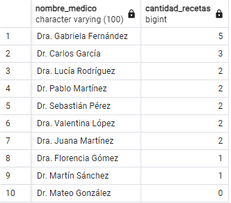
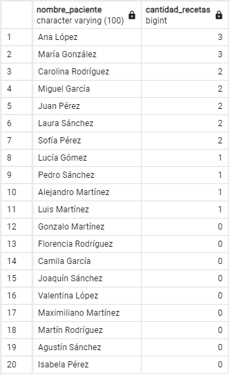
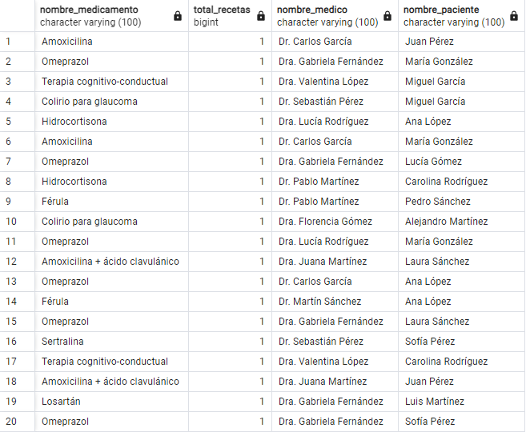

# Informe TP5

## Parte 1: Bases de Datos

**1. ¿Qué tipo de base de datos es?**

Se trata de una base de datos de tipo relacional. Esto se puede ver ya que, las bases de datos relacionales almacenan y gestionan información en tablas que pueden relacionarse entre sí. En este caso, las entidades como "Pacientes", "Médicos", "Medicamentos", "Consultas" y "Recetas" están claramente definidas y relacionadas entre sí.

**2. Armar el diagrama de entidad relación**


**3. ¿Considera que la base de datos está normalizada? En caso que no lo esté, ¿cómo podría hacerlo?**

Para normalizar una base de datos se debe tener en cuenta la tecera forma normal (3FN) que consta de tres niveles que debe seguir una base de datos correctamente normalizada:

- La Primera Forma Normal (1NF) dice que todas las columnas deben contener valores atómicos, es decir, no deben contener conjuntos de valores o valores repetidos.
- La Segunda Forma Normal (2NF) dice que debe estar en 1NF y además, no debe haber dependencia parcial de la clave primaria, es decir, todas las columnas que no son clave deben depender de la clave primaria completa.
- Por último, la Tercera Forma Normal (3NF) dice que debe estar en 2NF y además, no debe haber dependencias transitivas, es decir, una columna no clave no debe depender de otra columna no clave.

Para esta base de datos podemos ver que se encuentra en tercera forma normal y sin embargo cuenta con varios puntos de mejora. Para empezar, podríamos hacer una limpieza normalizando la cantidad de espacios en las variables de tipo _string_. Por ejemplo, hacer una función para que si tiene 2 espacios juntos en algún lado pasen a ser 1. Otro punto sería que no se permitan datos duplicados, es decir, que por ejemplo, en  la tabla pacientes no pueda haber dos pacientes con la misma información pero distintos `id`.


## Parte 2: SQL

Antes de resolver las consignas, al cargar la entidad `consultas` a pgAdmin nos encontramos con el siguiente error:


Esto se debe a que dentro de la tabla consultas figura un `id_medico = 13`, pero en la tabla de médicos los ID van del 1 al 10.

Por este motivo, se decidió modificar la tabla de consultas, y asignarle a ese registro el médico con `id_medico = 3` ya que el mismo se corresponde con un médico de cardiología y el presunto diagnóstico de la consulta es 'Presión arterial alta'.

**1. Obtener el nombre y la dirección de los pacientes que viven en Buenos Aires.**

En la BBDD a utilizar, observamos que algunos registros no coincidían exactamente con el _string_ 'Buenos Aires', sino que en algunos casos decían 'buenos bires' u otras variantes.

Lo que se decidió entonces, fue utilizar una extensión que nos permite hacer _fuzzy matching_[^1] y pasar los registros de la columna ciudad a minúscula para así obtener todos los registros correspondientes.

[^1]: Es una forma de matchear strings de forma parcial, útil cuando los datos no están tan limpios y las coincidencias buscadas no son exactas. Permite también seleccionar un grado de similitud de acuerdo al objetivo buscado.

``` sql
CREATE EXTENSION IF NOT EXISTS pg_trgm;

SELECT nombre, calle, numero
FROM pacientes
WHERE SIMILARITY(LOWER(TRIM(ciudad)), LOWER('Buenos Aires')) > 0.5;
```

Cuando vemos los resultados, encontramos que hay un par de registros duplicados. Es decir, pacientes con diferentes IDs pero mismo nombre y misma dirección. Por ejemplo, Lucía Gómez y Maximiliano Martínez.


**2. Obtener la cantidad de recetas emitidas por cada médico.**

Para obtener también los médicos que no emitieron ninguna receta, se hace un `RIGHT JOIN`.

``` sql
SELECT m.nombre AS nombre_medico, COUNT(r.id_medico) AS cantidad_recetas
FROM recetas r
RIGHT JOIN medicos m ON r.id_medico = m.id_medico
GROUP BY m.nombre
ORDER BY cantidad_recetas DESC;
```



**3. Obtener el nombre de los pacientes junto con la fecha y el diagnóstico de todas las consultas médicas realizadas en junio del 2024.**

``` sql
SELECT p.nombre as nombre_paciente, c.fecha, c.diagnostico
FROM consultas c
JOIN pacientes p ON c.id_paciente = p.id_paciente
WHERE c.fecha BETWEEN '2024-06-01' AND '2024-06-30';
```


**4. Obtener el nombre de los medicamentos prescritos más de una vez por el médico con ID igual a 2.**

El único medicamento recetado más de una vez fue el Omeprazol.

``` sql
SELECT m.nombre AS nombre_medicamento
FROM recetas r
JOIN medicamentos m ON r.id_medicamento = m.id_medicamento
WHERE r.id_medico = 2
GROUP BY m.nombre
HAVING COUNT(r.id_medicamento) > 1;
```


**5. Obtener el nombre de los pacientes junto con la cantidad total de recetas que han recibido.**

Para obtener también los pacientes que no recibieron ninguna receta, se hace un `RIGHT JOIN`.

```sql
SELECT p.nombre AS nombre_paciente, COUNT(r.id_paciente) AS cantidad_recetas
FROM recetas r
RIGHT JOIN pacientes p ON r.id_paciente = p.id_paciente
GROUP BY p.nombre;
```


**6. Obtener el nombre del medicamento más recetado junto con la cantidad de recetas emitidas para ese medicamento.**

Para obtener solamente el medicamento más recetado tuvimos que utilizar `LIMIT 1`.

```sql
SELECT m.nombre AS nombre_medicamento, COUNT(r.id_medicamento) AS cantidad_recetas
FROM medicamentos m
JOIN recetas r ON r.id_medicamento = m.id_medicamento
GROUP BY m.nombre
ORDER BY cantidad_recetas DESC
LIMIT 1;
```


**7. Obtener el nombre del paciente junto con la fecha de su última consulta y el diagnóstico asociado.**

Aquí volvemos a notar el problema de los registros duplicados, ya que vemos que hay nombres de pacientes que figuran dos veces.

```sql
SELECT p.nombre AS nombre_paciente, c.fecha, c.diagnostico
FROM pacientes p
JOIN consultas c ON p.id_paciente = c.id_paciente
WHERE c.fecha = (
	SELECT MAX(c2.fecha)
	FROM consultas c2
	WHERE c2.id_paciente = p.id_paciente
);
```


**8. Obtener el nombre del médico junto con el nombre del paciente y el número total de consultas realizadas por cada médico para cada paciente, ordenado por médico y paciente.**


```sql
SELECT m.nombre as nombre_medico, p.nombre AS nombre_paciente, COUNT(c.id_consulta) AS total_consultas
FROM consultas c
JOIN medicos m ON c.id_medico = m.id_medico
JOIN pacientes p ON c.id_paciente = p.id_paciente
GROUP BY m.nombre, p.nombre
ORDER BY nombre_medico, nombre_paciente;
```


**9. Obtener el nombre del medicamento junto con el total de recetas prescritas para ese medicamento, el nombre del médico que lo recetó y el nombre del paciente al que se le recetó, ordenado por total de recetas en orden descendente.**

Aquí vemos que ningún médico recetó al mismo paciente el mismo medicamento más de una vez.

```sql
SELECT m.nombre AS nombre_medicamento, COUNT(r.id_receta) AS total_recetas, m2.nombre AS nombre_medico, p.nombre AS nombre_paciente
FROM recetas r
JOIN medicamentos m ON r.id_medicamento = m.id_medicamento
JOIN medicos m2 ON r.id_medico = m2.id_medico
JOIN pacientes p ON r.id_paciente = p.id_paciente
GROUP BY m.nombre, m2.nombre, p.nombre
ORDER BY total_recetas DESC;
```



**10. Obtener el nombre del médico junto con el total de pacientes a los que ha atendido, ordenado por el total de pacientes en orden descendente.**

```sql
SELECT m.nombre, COUNT(DISTINCT r.id_paciente) AS total_pacientes
FROM recetas r
JOIN medicos m ON r.id_medico = m.id_medico
GROUP BY m.nombre
ORDER BY total_pacientes DESC;
```

